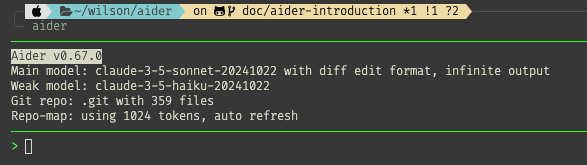

# Aider Introduction
## Core Concepts & Best Practices

---

# What is Aider?

- Command-line AI coding assistant
- Seamless Git integration
- Natural language interaction with your codebase
- Lightweight and powerful

---

# Getting Started with Aider

- Easy installation and setup
- Simple command-line interface
- Works with existing Git repositories
- Supports multiple LLM models

---

# Core Technical Concepts

## Repo Map
- Intelligent codebase understanding
- Efficient context management
- Smart file retrieval

## Concrete Syntax Tree (CST)
- Precise code analysis
- Accurate modifications
- Language-aware changes

---

# LLM Integration

- Custom-designed prompt templates
- Optimized for code understanding
- Enhanced retrieval system
- Context-aware responses

---

# Best Practices

✅ DO:
- Add relevant context to your prompts
- Use for code understanding and documentation
- Leverage for code maintenance
- Verify generated code

❌ DON'T:
- Use as a search engine
- Trust blindly without verification
- Expect perfect code generation

---

# Real-world Applications

- Code Understanding
  - Dependency analysis
  - Architecture visualization
  - Flow diagrams

- Documentation
  - Automated documentation
  - Sequence diagrams
  - PR documentation

- Maintenance
  - Unit test generation
  - Bug fixing
  - Code improvements

---

# Key Advantages

- Lightweight implementation
- No IDE dependencies
- No language server required
- Full Git integration
- CLI-first approach

---

# Building Better LLM Applications

Focus areas:
1. Prompt template design
2. Intelligent context retrieval
3. Appropriate model selection
4. Integration with existing tools

---

# Thank You!

For more information:
- GitHub: https://github.com/paul-gauthier/aider
- Documentation: https://aider.chat
